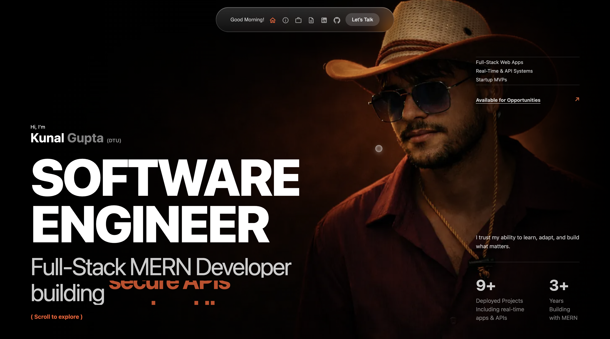
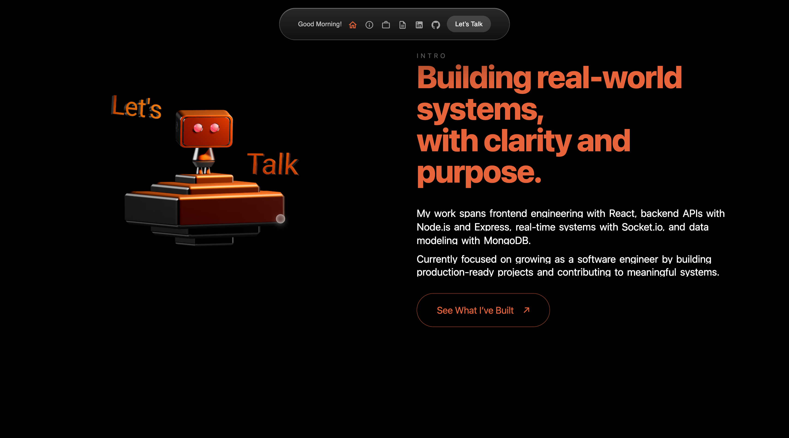
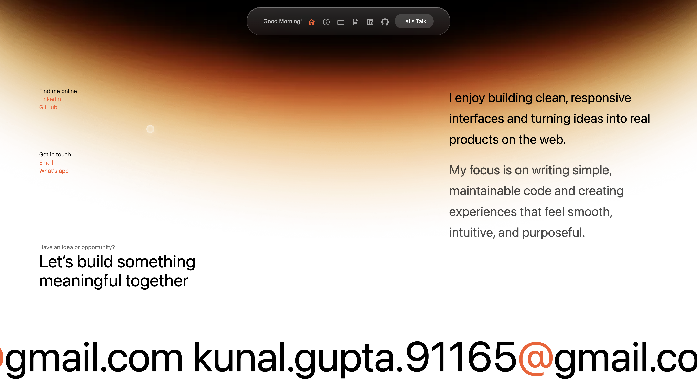

# Portfolio Website – Kunal Gupta

Live Demo: https://portfolio-website-chi-gilt.vercel.app  
GitHub Profile: https://github.com/Kunal-Gupta28  

## About
This is my personal portfolio website built to showcase my projects, skills, and experience as a MERN Stack Developer.  
I am a final-year engineering student actively looking for internship and junior developer opportunities where I can learn, contribute, and grow as a software developer.

The portfolio highlights my technical skills, real-world projects, and provides an easy way to contact me.

## Purpose
The main purpose of this portfolio is to demonstrate my frontend development skills, project experience, and ability to build responsive and user-friendly web applications.

## Tech Stack
Frontend:
- React
- HTML
- CSS
- JavaScript

Tools:
- Git
- GitHub
- VS Code

Deployment:
- Vercel

## Features
- Fully responsive design for mobile, tablet, and desktop
- Projects section with descriptions and live links
- Skills section highlighting technical expertise
- About section with brief background
- Contact section for easy communication
- Clean and simple user interface

## Screenshots
  
  


## Project Structure
```text
Portfolio-website/
├── public/
├── src/
│   ├── components/
│   ├── pages/
│   ├── assets/
│   ├── App.js
│   └── index.js
├── package.json
└── README.md
