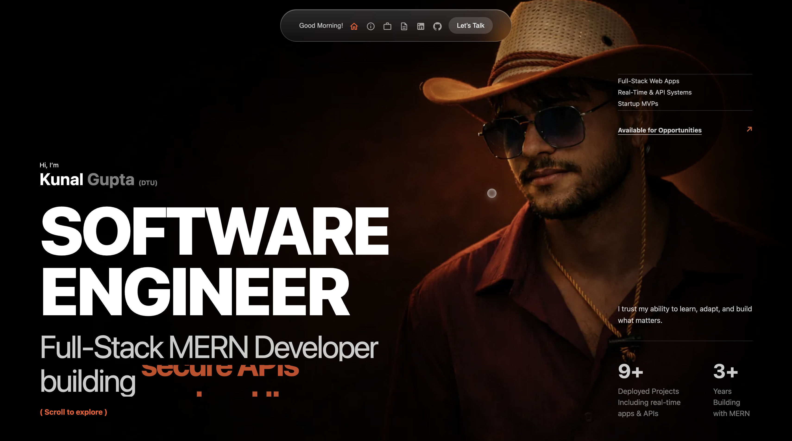
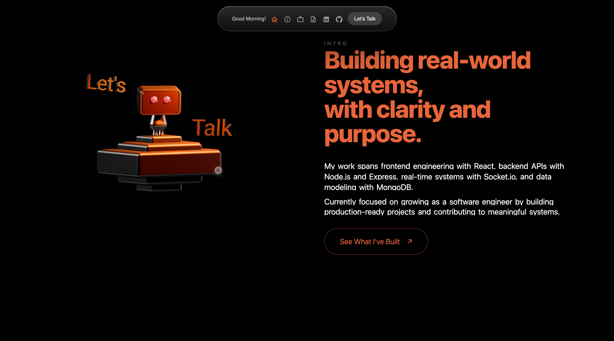
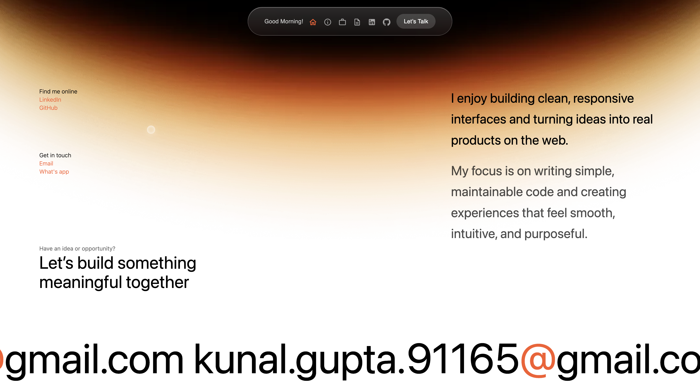

# ⚡ Kunal Gupta — Full-Stack Developer Portfolio

[](https://portfolio-website-chi-gilt.vercel.app)
[](https://github.com/Kunal-Gupta28)
[](LICENSE)

A high-performance, full-stack personal portfolio website showcasing real-time applications, interactive 3D elements, smooth motion design, and backend system integrations. Built with **React 18**, **Vite**, **Tailwind CSS v4**, **GSAP**, **Framer Motion**, **Spline 3D**, and a robust **Node.js/Express** backend.

---

## 🌐 Live Preview & Links

- 🔗 **Live Website**: [portfolio-website-chi-gilt.vercel.app](https://portfolio-website-chi-gilt.vercel.app)
- 🐙 **GitHub Repository**: [github.com/Kunal-Gupta28/Portfolio-website](https://github.com/Kunal-Gupta28/Portfolio-website)

---

## ✨ Features & Highlights

- 🎨 **Modern Motion & 3D Visuals**: Smooth 3D scene rendering powered by **Spline 3D**, coupled with **GSAP ScrollTrigger** and **Framer Motion** physics for fluid interactive transitions.
- 📜 **Lenis Smooth Scroll**: Integrated smooth momentum scrolling for an effortless reading experience.
- 🖱️ **Interactive Glass Cursor**: Responsive custom cursor with dynamic glassmorphism effect (automatically disabled on mobile devices for peak performance).
- 🚀 **Full-Stack Architecture**: Monorepo layout containing a modern Vite-powered React SPA frontend and an Express REST API backend for contact processing.
- 📧 **Secure Contact API & Email Service**: Backend features rate-limiting (`express-rate-limit`), input validation (`express-validator`), HTML sanitization (`sanitize-html`), MongoDB message persistence, and instant email dispatch via **Nodemailer**.
- 🗂️ **Dynamic Project Showcase**: Interactive project cards with category filtering, modal detail views, and direct links to live deployments and GitHub repositories.
- ⚡ **Optimized Code Splitting**: Utilizes `React.lazy` and `Suspense` for asynchronous page route loading with low latency.
- 📱 **Fully Responsive Layout**: Mobile-first design that adapts seamlessly from small smartphones to ultra-wide desktop displays.

---

## 🛠️ Tech Stack

### **Frontend**
- **Core Framework**: React 18, Vite 7, React Router DOM v6
- **Styling**: Tailwind CSS v4, Material UI (MUI v5)
- **Animations & Motion**: GSAP 3 (ScrollTrigger), Framer Motion, Lenis Smooth Scroll
- **3D & Canvas**: `@splinetool/react-spline`
- **HTTP Client**: Axios

### **Backend**
- **Runtime & Framework**: Node.js, Express.js 5
- **Database**: MongoDB (Mongoose ORM)
- **Security & Validation**: Express Rate Limit, Express Validator, Sanitize-HTML, CORS
- **Mailing Service**: Nodemailer

### **Infrastructure & Tooling**
- **Version Control**: Git, GitHub
- **Deployment**: Vercel (Frontend & Serverless deployment)
- **Linting & Code Quality**: ESLint, Vitest

---

## 📁 Repository Structure

```text
Portfolio-website/
├── frontend/                   # React 18 + Vite Frontend Application
│   ├── public/                 # Static assets & favicon
│   ├── src/
│   │   ├── components/         # Reusable UI components
│   │   │   ├── About/          # About page sections
│   │   │   ├── Footer/         # Global footer component
│   │   │   ├── Landing page/   # Hero & Intro sections (Spline, GSAP, Motion)
│   │   │   ├── Navbar/         # Responsive navigation header
│   │   │   ├── contact/        # Contact action forms & components
│   │   │   ├── projects/       # Project grid, filters & modals
│   │   │   └── GlassCursor.jsx # Interactive custom cursor
│   │   ├── context/            # Global state context (LoaderContext)
│   │   ├── data/               # Project showcase data & categories
│   │   ├── hooks/              # Custom hooks (useIsDesktop, useDocumentTitle, etc.)
│   │   ├── pages/              # Lazy-loaded route pages (Landing, About, Projects, Contact, NotFound)
│   │   ├── App.jsx             # Main app routes & providers
│   │   └── main.jsx            # Entry point
│   ├── package.json
│   └── vite.config.js
│
├── backend/                    # Node.js + Express REST API Backend
│   ├── config/                 # Database connection settings
│   ├── controllers/            # Contact form controller logic
│   ├── middlewares/            # Rate limiting & validation middleware
│   ├── models/                 # Mongoose schemas (Contact model)
│   ├── routes/                 # Express API routes
│   ├── utils/                  # Nodemailer & input sanitizer utilities
│   ├── app.js                  # Express app setup & middlewares
│   ├── server.js               # Server entry point
│   └── package.json
│
├── images/                     # Screenshots & visual showcase assets
└── README.md                   # Project documentation
```

---

## 🚀 Getting Started

Follow these steps to run the portfolio locally on your machine.

### **Prerequisites**
- **Node.js**: `v18.0.0` or higher
- **npm** or **yarn**
- **MongoDB**: Local MongoDB instance or MongoDB Atlas connection URI

---

### **1. Clone the Repository**

```bash
git clone https://github.com/Kunal-Gupta28/Portfolio-website.git
cd Portfolio-website
```

---

### **2. Frontend Setup**

```bash
# Navigate to the frontend directory
cd frontend

# Install frontend dependencies
npm install

# Start the Vite development server
npm run dev
```

The frontend will be running locally at `http://localhost:5173`.

---

### **3. Backend Setup**

```bash
# Open a new terminal and navigate to the backend directory
cd backend

# Install backend dependencies
npm install

# Create a .env file in the backend directory
touch .env
```

Add the following environment variables to your `backend/.env` file:

```env
PORT=5000
MONGO_URI=mongodb+srv://<username>:<password>@cluster.mongodb.net/portfolio
EMAIL_HOST=smtp.gmail.com
EMAIL_PORT=587
EMAIL_USER=your-email@gmail.com
EMAIL_PASS=your-app-password
RECEIVER_EMAIL=your-receiving-email@gmail.com
CLIENT_URL=http://localhost:5173
```

Run the backend server:

```bash
# Start backend server in development mode
npm run dev
```

The backend server will start at `http://localhost:5000`.

---

## 📸 Screenshots & Visual Preview

| Hero Section | Introduction & Interactive 3D |
| :---: | :---: |
|  |  |

| Footer & Contact Section |
| :---: |
|  |

---

## 🌟 Featured Projects Showcase

Here are some key projects showcased in this portfolio:

- **[ChatCraft](https://github.com/Kunal-Gupta28/ChatCraft)**: Real-time collaborative coding and chat platform integrated with **Google Gemini API**, Socket.io, Redis caching, and Cloudinary.
- **[Kubik Ride Booking App](https://github.com/Kunal-Gupta28/kubik)**: Full-stack ride booking platform featuring real-time tracking (Socket.io), dynamic fare calculation, Razorpay payments, and GSAP physics.
- **[WanderLust](https://github.com/Kunal-Gupta28/WanderLust)**: Travel destination sharing platform with user authentication (Express-session), CRUD reviews, EJS templating, and MongoDB Atlas.
- **[Works Studio](https://github.com/Kunal-Gupta28/Works-sutdio)**: Modern animated portfolio website built with GSAP, Locomotive Scroll, and Framer Motion.

---

## 👨‍💻 Author

**Kunal Gupta**  
- 🎓 Software Engineering Student at **Delhi Technological University (DTU)**
- 💼 MERN Stack & Full-Stack Web Developer
- 🐙 GitHub: [@Kunal-Gupta28](https://github.com/Kunal-Gupta28)
- 🌐 Live Portfolio: [portfolio-website-chi-gilt.vercel.app](https://portfolio-website-chi-gilt.vercel.app)

---

## 📜 License

This project is licensed under the [MIT License](LICENSE).
